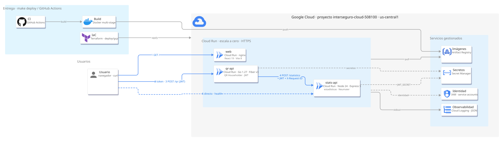
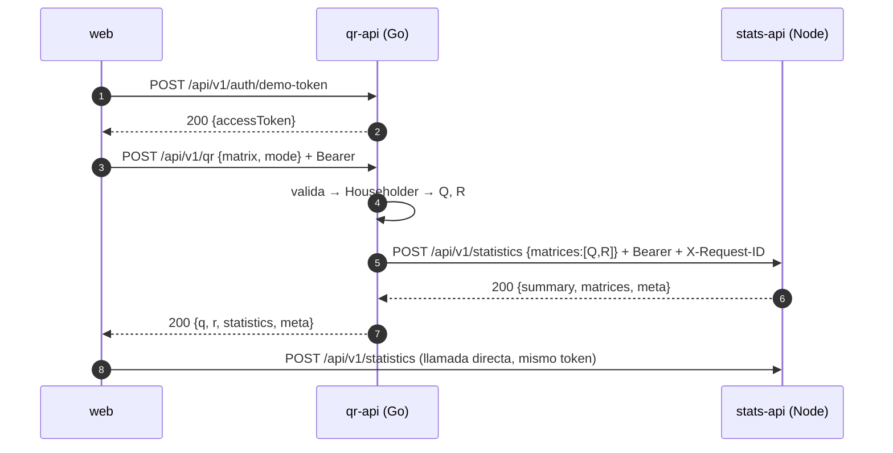

# Factorización QR y estadísticas

Dos APIs REST que se comunican por HTTP, un frontend que las consume y despliegue en Google Cloud.

- **qr-api** (Go 1.27 + Fiber v3) recibe una matriz rectangular, calcula su factorización QR por
  reflexiones de Householder y envía las matrices resultantes a la segunda API.
- **stats-api** (Node 24 + Express 5 + TypeScript) recibe las matrices y devuelve máximo, mínimo,
  promedio, suma total y si alguna de ellas es diagonal.
- **web** (React 19 + Vite) consume las dos APIs y muestra Q, R y las estadísticas.

## Demo en línea

| Servicio | URL |
|---|---|
| Aplicación web | <https://web-733632061125.us-central1.run.app> |
| qr-api · Swagger UI | <https://qr-api-733632061125.us-central1.run.app/docs> |
| stats-api · Swagger UI | <https://stats-api-733632061125.us-central1.run.app/docs> |

Al abrirse, la web pide un **token de demo** a qr-api y con él firma todas sus llamadas; no hay
que escribir credenciales. Es una decisión para la demo, no una puerta abierta: las dos APIs
siguen exigiendo un JWT válido en cada petición, y ese endpoint solo existe con
`DEMO_TOKEN_ENABLED=true`, porque un navegador es un cliente público que no puede custodiar un
secreto. El flujo con `clientId` y `clientSecret` sigue disponible para clientes confidenciales
(ver [Cómo funciona](#cómo-funciona), punto 1).

Elige un ejemplo (identidad, diagonal, rectangular, rango deficiente), pulsa **Calcular QR** y
verás A, Q, R, las estadísticas y un botón para recalcularlas llamando directamente a stats-api.
Al pie, el apartado **Detalles técnicos** muestra lo que ocurre por debajo: las URLs de las dos
APIs, el token en uso con su expiración, las versiones desplegadas, los metadatos de la
respuesta (`requestId`, tiempos, dimensiones de Q y R) y un `curl` del flujo con credenciales.
Para llamar a las APIs sin la web, ver [Probar la API en línea](#probar-la-api-en-línea).

## Arquitectura

[](assets/architecture.png)



Cada servicio sigue una arquitectura hexagonal: un dominio sin dependencias externas (el álgebra
en Go, las estadísticas en Node), casos de uso con puertos, y adaptadores HTTP de entrada y de
salida. Los contratos entre servicios están en `apps/*/openapi.yaml` y las respuestas de referencia
en `contracts/examples/`, que las tres suites de pruebas leen.

## Cómo funciona

1. **Autenticación.** qr-api emite JWT HS256 (`iss`, `aud` por servicio, `exp` de una hora) y las dos
   APIs lo verifican con lista blanca de algoritmos. `POST /api/v1/auth/token` recibe `clientId` y
   `clientSecret` (el servidor guarda solo el SHA-256 del secreto y compara en tiempo constante) y
   está pensado para clientes que pueden custodiar un secreto: `curl`, Swagger, el script e2e.
   Como un navegador no puede guardar un secreto, la web usa `POST /api/v1/auth/demo-token`, que
   emite el mismo token sin credenciales, solo existe con `DEMO_TOKEN_ENABLED=true` y comparte la
   cuota por IP de la ruta de token.
2. **Factorización.** `POST /api/v1/qr` valida la matriz (rectangular, números finitos, hasta
   100×100) y aplica Householder: QR completa por defecto (Q de m×m, R de m×n) o `mode: "reduced"`.
   La diagonal de R se normaliza a valores no negativos para que la salida sea determinista. Un
   reescalado por potencias de dos evita desbordamientos con magnitudes extremas.
3. **Estadísticas.** qr-api reenvía `{matrices: [Q, R]}` a stats-api con el token del llamante y el
   `X-Request-ID`, con un tiempo límite y un reintento si la llamada falla. stats-api suma con el
   algoritmo compensado de Neumaier y decide si una matriz es diagonal con tolerancia híbrida
   `max(1e-12, 1e-9·max|aᵢⱼ|)`. Si stats-api no responde, qr-api devuelve 502 o 504, nunca un
   resultado parcial.
4. **Errores.** Ambas APIs responden con RFC 9457 (`application/problem+json`): mismo `type`,
   mismo `title`, `requestId` igual al header `X-Request-ID`, y en un 422 la lista de campos con
   puntero JSON y código (`ragged_row`, `non_finite_value`, `too_many_rows`…).

## Qué se implementó

| Área | Detalle |
|---|---|
| Requerido | Dos APIs REST (Go/Fiber y Node/Express), QR en Go, estadísticas en Node, comunicación HTTP, Docker, despliegue en la nube |
| Opcional | Frontend que consume ambas APIs, JWT en las dos, pruebas unitarias e integración |
| Pruebas | Go: invariantes numéricos (`‖QR−A‖`, `‖QᵀQ−I‖`), fuzzing, tests HTTP; Node: 156 tests con property-based; web: 30; smoke e2e de 51 aserciones; validación de respuestas reales contra OpenAPI |
| Seguridad | JWT con `alg` allow-list y `aud` por servicio, rate limiting, límites de tamaño, CORS explícito, cabeceras de seguridad, imágenes non-root, secretos en Secret Manager, service accounts sin roles de proyecto |
| Operación | Health checks, logs JSON correlados por `X-Request-ID`, Terraform para Cloud Run, imágenes ancladas por digest, rollback, CI con lint, tests, cobertura y escaneo de imágenes |

## Ejecutar en local

Requisitos: Docker con Compose v2 y `make`. Para desarrollar: Go 1.27 y Node 22 o superior.

```bash
cp .env.example .env && ./scripts/gen-secrets.sh   # genera JWT_SECRET y la credencial de demo
make up                                              # web :8081 · qr-api :8080 · stats-api :3000
make demo                                            # recorre todo el flujo con curl
make test                                            # suites de Go, Node y web
make e2e                                             # smoke sobre los contenedores
```

Ejemplo directo con `curl`:

```bash
TOKEN=$(curl -s -X POST http://localhost:8080/api/v1/auth/demo-token | jq -r .accessToken)
curl -s -X POST http://localhost:8080/api/v1/qr \
  -H "Authorization: Bearer $TOKEN" -H 'Content-Type: application/json' \
  -d '{"matrix":[[1,2],[3,4],[5,6]]}' | jq '{q, r, summary: .statistics.summary}'
```

## Despliegue

`make deploy-cloud` construye las tres imágenes en Cloud Build, las publica en Artifact Registry y
aplica Terraform (`deploy/gcp`): tres servicios de Cloud Run con escala a cero, secretos en Secret
Manager y una service account por servicio. Termina con el smoke contra las URLs públicas.
`make rollback` devuelve el tráfico a la revisión anterior.

## Estructura

```
apps/qr-api      Go · dominio (matrix, qr) · aplicación · adaptadores HTTP · cliente de stats-api
apps/stats-api   Node · dominio (statistics) · aplicación · adaptadores HTTP
apps/web         React · editor de matrices, resultados, sesión de demo
contracts/       respuestas de referencia compartidas por las tres suites
deploy/gcp       Terraform para Cloud Run
scripts/         secretos, smoke e2e, validación de contratos, demo, despliegue, rollback
```

## Probar la API en línea

No hace falta clonar ni desplegar nada: son las mismas URLs de la [demo en línea](#demo-en-línea).
El token de demo se pide sin credenciales y vale para las dos APIs durante una hora:

```bash
TOKEN=$(curl -s -X POST https://qr-api-733632061125.us-central1.run.app/api/v1/auth/demo-token | jq -r .accessToken)

# Factorización QR + estadísticas en una sola llamada (qr-api llama a stats-api por detrás)
curl -s -X POST https://qr-api-733632061125.us-central1.run.app/api/v1/qr \
  -H "Authorization: Bearer $TOKEN" -H 'Content-Type: application/json' \
  -d '{"matrix":[[1,2],[3,4],[5,6]]}' | jq '{q, r, summary: .statistics.summary}'

# stats-api directamente, con el mismo token: acepta N matrices
curl -s -X POST https://stats-api-733632061125.us-central1.run.app/api/v1/statistics \
  -H "Authorization: Bearer $TOKEN" -H 'Content-Type: application/json' \
  -d '{"matrices":[[[1,0],[0,1]],[[2,3],[0,4]]]}' | jq .summary

# Un error de validación llega como RFC 9457 (application/problem+json)
curl -s -X POST https://qr-api-733632061125.us-central1.run.app/api/v1/qr \
  -H "Authorization: Bearer $TOKEN" -H 'Content-Type: application/json' \
  -d '{"matrix":[[1,2],[3]]}' | jq .
```

Swagger UI en [`/docs`](https://qr-api-733632061125.us-central1.run.app/docs) de cada API permite
hacer estas mismas llamadas desde el navegador: pega el token en **Authorize**.

El flujo con `clientId` y `clientSecret` (`POST /api/v1/auth/token`) también está activo en la
nube. Las credenciales no se publican en este repositorio y se entregan por un canal aparte; el
token que devuelve es idéntico al de demo salvo por el `sub`, y sirve para las mismas llamadas:

```bash
TOKEN=$(curl -s -X POST https://qr-api-733632061125.us-central1.run.app/api/v1/auth/token \
  -H 'Content-Type: application/json' \
  -d '{"clientId":"demo-client","clientSecret":"<secreto entregado aparte>"}' | jq -r .accessToken)

curl -s -X POST https://qr-api-733632061125.us-central1.run.app/api/v1/qr \
  -H "Authorization: Bearer $TOKEN" -H 'Content-Type: application/json' \
  -d '{"matrix":[[1,0,0],[0,1,0],[0,0,1]]}' | jq '.statistics.summary'
```

Con un secreto incorrecto la respuesta es `401 urn:proyectot:problem:unauthorized`, idéntica para
un `clientId` desconocido, de modo que no se pueden enumerar clientes.

Licencia [MIT](./LICENSE).
